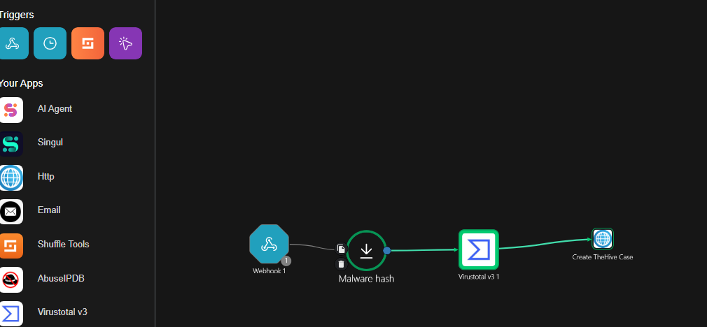
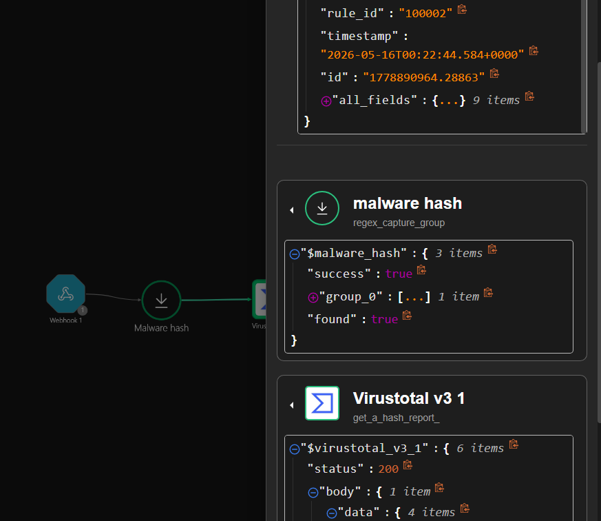
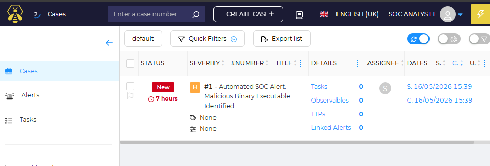

# Wazuh-SOAR-Incident-Pipeline
# Automated SOC Triage & Closed-Loop Incident Response Pipeline

## 📌 Architecture Overview
This repository documents an enterprise-grade, closed-loop Security Orchestration, Automation, and Response (SOAR) pipeline built inside a self-hosted home lab enclave. The architecture automates the ingestion, enrichment, and escalation of endpoint threats while maintaining strict internal data governance.

Unlike entry-level projects that dump plaintext indicators of compromise (IOCs) into public messaging apps or unencrypted external webmails, this design implements a **closed-loop workflow**. Sensitive telemetry (internal IPs, hostnames, and file paths) is kept entirely behind the firewall, orchestrating data transfer locally via containerized REST API handshakes.

### 🌐 Network Topology & Playbook Canvas


---

## 🛠️ The Technical Security Stack
* **SIEM / XDR:** Wazuh (Aggregating host event telemetry and detecting endpoint anomalies)
* **SOAR Platform:** Shuffle (Orchestrating playbook execution logic, webhook listening, and data routing)
* **Threat Intelligence:** VirusTotal API v3 (Automating multi-scanner file hash reputation checks)
* **Incident Management:** TheHive (Centralized ticketing dashboard for analyst triage)

---

## 🔄 Automated Workflow Lifecycle
1. **Detection:** A malicious file execution occurs on a monitored endpoint. The local **Wazuh** agent intercepts the event log and dispatches it via a secure webhook payload straight to the self-hosted **Shuffle** instance.
2. **Parsing & Extraction:** Shuffle processes the raw log using regex capture groups to dynamically isolate the file's SHA256 hash.
3. **Threat Intelligence Enrichment:** Shuffle triggers an automated API call to **VirusTotal**, passing the extracted hash to check global multi-scanner verdicts.
4. **Case Escalation:** Upon positive malicious confirmation, Shuffle formats a structured markdown payload and fires an authorized internal REST API `POST` request directly into **TheHive** alert ingestion queue (`/api/alert`).
5. **Analyst Triage:** A high-severity case file is automatically provisioned inside TheHive, presenting the human analyst on duty with a complete threat dossier immediately.

---

## 💻 Code & Integration Layout

### API Ingestion Schema (Shuffle to TheHive Case Mappings)
The final node executes an HTTP `POST` handshake using local bearer token authorization. Below is the structured JSON configuration model deployed within the automation worker:

```json
{
  "title": "Automated SOAR Escalation: Mimikatz Malware Confirmed",
  "description": "Shuffle SOAR has successfully intercepted an endpoint log event from Wazuh and performed automatic enrichment mapping.\n\n### Investigation Diagnostics:\n* **Target Asset:** Windows Production Host\n* **Extracted Hash File:** DF6A740B0589DBD058227D3FCAB1F1A847B4AA73FEAB9A2C157AF31D95E0356F\n* **VirusTotal Validation:** Malicious Content Confirmed (Mimikatz Usage Detected)\n* **Playbook Action:** Incident escalation route initialized.",
  "severity": 3,
  "source": "Wazuh-SIEM",
  "type": "Malware-Enrichment",
  "sourceRef": "WAZUH-ALERT-177889"
}
```
## 🛡️ Engineering Takeaways & Privacy Hardening
* **Zero-Trust Data Isolation:** By routing malicious payloads to an internal case management system rather than external messaging webhooks, this deployment complies with enterprise strict data residency and data hygiene policies.

* **Alert Fatigue Mitigation:** Automated enrichment reduces analyst triage time from minutes to milliseconds, ensuring that human intervention is reserved strictly for high-fidelity, validated incidents.

---

## 📸 Deployment Gallery & Verification

### Successful Playbook Execution & API Handshake (Shuffle)
*The screenshot below verifies successful log parsing, regex evaluation, and a `200 OK` return code from the VirusTotal API threat evaluation threat loop.*


### Automated Alert Creation (TheHive Dashboard)
*The final output showing the security alert successfully generated within the localized analyst triage queue with rich markdown context.*

